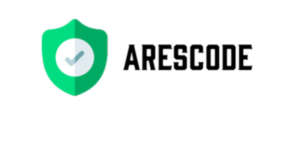

[](https://twitter.com/johandu0) <br/>
[](https://github.com/johandu1997/Arescode/blob/master/LICENSE)  []()  []()  []() [](https://github.com/johandu1997/Arescode/issues)  [](https://www.youtube.com/watch?v=5btrMPHi8Y8&t=6s)




## About Arescode

Create responsive code directory structure based on living URLs. Return redirect and error information.

## Installation

```
git clone https://github.com/johandu1997/Arescode.git
```

## Dependencies

* Installation on Linux

```
pip install -r requirements.txt
```

## Setup

* Installation on Linux
```
./build.sh
```
## Usage

```
arescode -f <subdomains_file>
```

Short Form    | Long Form     | Description
------------- | ------------- |-------------
-f            | --file        | Enter the filename contain URLs
-t            | --thread      | Number of threads
-h            | --help        | Show the help message and exit

## Examples

1. Make a search of living subdomains and return responsive code directory structure
  
```
arescode -f sony.com-final.txt
```

2. Make a search of living subdomains and return responsive code directory structure with threading
  
```
arescode -f sony.com-final.txt -t 50
```

## Issues and requests

If you have a problem or a feature request, open an [issue](https://github.com/johandu1997/Arescode/issues).

## License

Domains is licensed under the GNU GPL license. take a look at the [LICENSE](https://github.com/johandu1997/Arescode/blob/master/LICENSE) for more information.

## Thanks

* Special Thanks to infosec community.

## Version

**Current version is 1.0**

## Donate me

If you want the tool to keep growing, you can donate to me to keep me motivated to develop more new features in the future.

[](https://www.paypal.me/johandu97)
